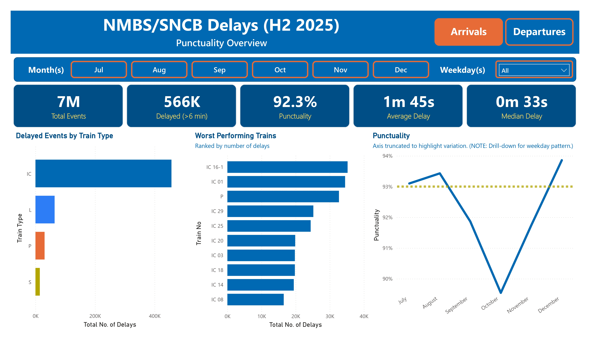
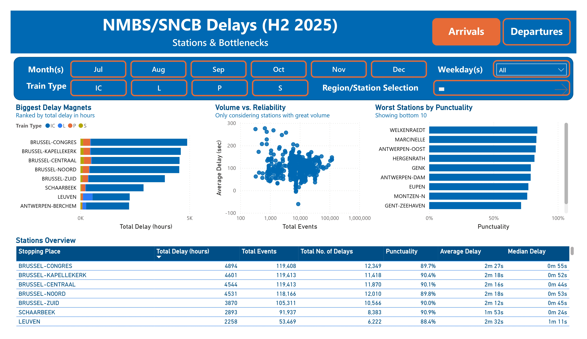
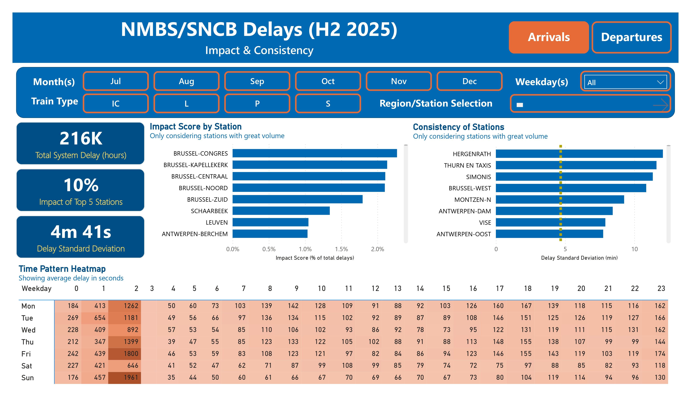

# 🚆 NMBS / SNCB Punctuality & Delay Analysis (H2 2025)

## 📊 Project Overview

This project analyzes railway punctuality and operational delay patterns in Belgium using official Infrabel punctuality data for the last 6 months of 2025.

The goal is to move beyond simple delay counts and answer:
- How punctual is the network overall?
- Which stations contribute most to system-wide delays?
- Are delays concentrated or distributed?
- Which stations are unpredictable?
- At what times do delays spike?

The project focuses on dimensional modeling, advanced DAX, and analytical storytelling in Power BI.

---

## 📷 Dashboard Preview

This dashboard analyzes railway punctuality and operational delay patterns in Belgium using official Infrabel data (H2 2025).

Below is a preview of the interactive Power BI report.

### 📌 Network Overview

### 🚉 Stations & Bottlenecks

### 📊 Impact & Consistency

---

## 🗂️ Project Structure

### 📁 01 - Raw data
Contains original CSV files downloaded from Infrabel for July–December 2025.

These files are:
- Unmodified
- Stored in original format
- Used as source data

---

### 📊 02 - Excel

Contains:

- Excel template with Power Query transformations
- Text file containing the full M code used for data preparation

Excel Power Query was used to design and test the transformation pipeline before loading the data into Power BI.

The transformation steps include:

- Importing raw CSV files using a parameterized file path
- Promoting headers and enforcing strict data types
- Removing duplicate records
- Removing unused operational columns
- Parsing train relation fields to extract:
  - Train Type (IC, S, L, P)
  - Train Relation
  - Starting Station
  - Ending Station
- Filtering to include only passenger-relevant train types
- Standardizing and renaming columns to business-friendly names
- Merging date and time columns into proper DateTime fields:
- Creating boolean helper fields:
  - HasArrival
  - HasDeparture
- Cleaning empty string values to proper nulls
- Removing infrastructure-only nodes (yards, depots, freight areas, maintenance zones)

The result is a cleaned, passenger-focused dataset ready for dimensional modeling in Power BI.

---

### 📈 03 - PowerBI

Contains:

- `.pbix` file with the full analytical model
- Power BI Power Query M code (exported to text)

Power BI includes:

- Star schema modeling
- Calendar and Hour dimension tables
- Dynamic Arrivals / Departures selector
- Context-aware DAX measures
- Impact % (station share of total system delay)
- Delay standard deviation (consistency metric)
- Log-scale scatter plot
- Time-pattern heatmap

---

## 📑 Dashboard Pages

### 📌 Network Overview
High-level performance indicators:
- Total events: Total number of events recorded
- Delayed events (>6 min): Defined according to Belgian railway standards
- Punctuality rate: Percentage of events that are on time
- Average & median delay: Provides insight into typical delay durations

Includes monthly trend analysis and train-type breakdown.

---

### 🚉 Stations & Bottlenecks
Identifies where delays concentrate:
- Total delay (hours) per station: Gives a clear picture of which stations contribute most to overall delays 
- Volume vs reliability (log-scale scatter): Plots station traffic against punctuality to identify high-impact stations
- Worst punctuality ranking: Get an insight into which stations have the lowest on-time performance
- Station performance table: Detailed metrics for each station, giving a comprehensive view of punctuality and delay patterns

Infrastructure-only nodes were excluded to focus on passenger-relevant stations.

---

### 📊 Impact & Consistency
Advanced analytical view:
- Total system delay (hours): Overall delay across the network
- Top 5 stations' share of total delay: Shows how much of the total delay is attributable to the biggest delay contributors
- Delay standard deviation (volatility): Measures how consistent or unpredictable delays are at each station
- Station impact ranking: Ranks stations by their contribution to system-wide delays
- Hour × Weekday heatmap: Visualizes when delays are most likely to occur, highlighting peak problem times

This page highlights whether delays are concentrated, predictable, or systemic.

---

## 🧠 Key Analytical Concepts

- **Impact %** = Station delay / Total system delay  
- **Delay Standard Deviation** = Volatility of delays (consistency measure)  
- **Log-scale scatter** to properly visualize volume disparities  
- **Volume thresholds** to avoid distortion from low-traffic stations  

---

## 🛠️ Tools Used

- Microsoft Excel (Power Query)
- Power BI
- DAX (advanced measures & context handling)

---

## 📝 Notes

- Data sourced from Infrabel punctuality reports.
- Project focuses on analytical modeling and performance insight.
- Designed as a portfolio project demonstrating BI modeling and DAX proficiency.

---

## 🚀 Future Extensions

Potential future improvements:
- Full-year analysis: Currently focused on H2 2025, but could be expanded to include the entire year for a more comprehensive view. Limited to H2 due to memory constraints in Power BI with large datasets.
- Automated data ingestion: Setting up a pipeline to automatically pull and refresh data from Infrabel's reports would allow for real-time analysis and ongoing monitoring of punctuality trends.
- Delay propagation modeling: Analyzing how delays at one station affect subsequent stations and overall network performance could provide deeper insights into systemic issues and potential mitigation strategies.
- Passenger impact weighting: Incorporating passenger volume data to weight delays by the number of affected passengers would give a more accurate picture of the real-world impact of delays on commuters and travelers.
