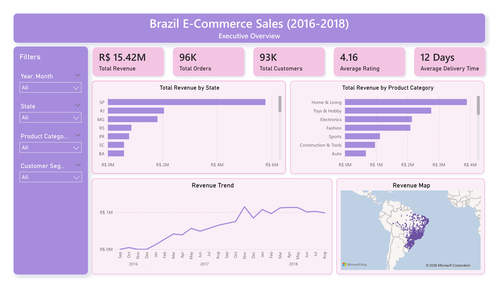
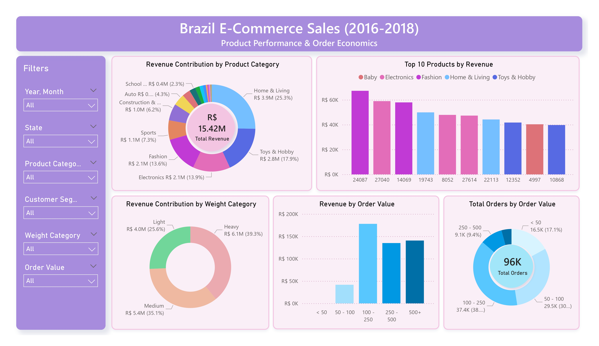
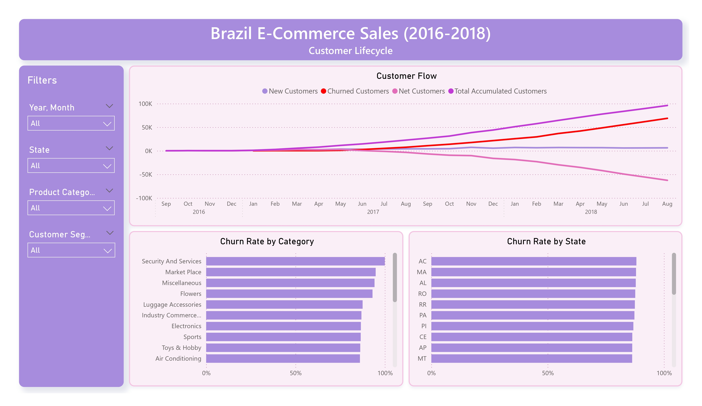
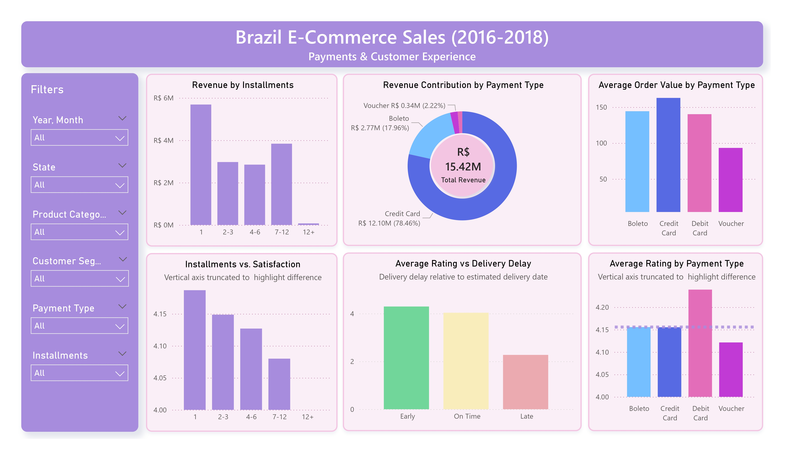

# 🛒 Brazil E-Commerce Sales & Customer Analytics (2016–2018)

## 📊 Project Overview

This project analyzes transactional e-commerce data from a large Brazilian marketplace (provided by Olist) covering 2016–2018.

The objective is to move beyond simple revenue reporting and answer:

* What drives revenue across products and order values?
* How does the customer base grow and churn over time?
* Are delays impacting customer satisfaction?
* How do payment behavior and installments influence revenue and customer satisfaction?
* Is revenue concentrated in specific segments or distributed broadly?

The project emphasizes:

* Relational modeling in SQL (MySQL)
* Star schema design
* Advanced DAX (churn modeling, cumulative logic, growth metrics)
* Analytical storytelling in Power BI

---

## 📥 Data Source

Data is sourced from the publicly available **Olist Brazilian E-Commerce Dataset** on Kaggle:

🔗 [https://www.kaggle.com/datasets/olistbr/brazilian-ecommerce](https://www.kaggle.com/datasets/olistbr/brazilian-ecommerce)

The dataset includes:

* Orders
* Order items
* Customers
* Products
* Sellers
* Payments
* Reviews
* Geolocation data

The data represents real commercial transactions between 2016 and 2018.

---

## 📷 Dashboard Preview

This dashboard analyzes revenue performance, product dynamics, customer lifecycle, and payment behavior across the Brazilian e-commerce marketplace (2016–2018).

### 📌 Executive Overview

### 📦 Product Performance & Order Dynamics

### 👥 Customer Lifecycle

### 💳 Payments & Customer Experience

---

## 🗂️ Project Structure

### 📁 01 - Raw Data

Contains the original CSV files downloaded from the Olist Kaggle dataset.

These files are:

* Unmodified
* Stored in original format
* Used as source data for SQL ingestion

This ensures reproducibility and transparency of the data pipeline.

---

### 🛠️ 02 - SQL

Contains all SQL scripts used to build the analytical data model.

#### 01 - Staging Tables.sql

* Creation of raw staging tables
* Definition of data types
* CSV ingestion using `LOAD DATA INFILE`

#### 02 - Cleaning & Modeling.sql

* Filtering to delivered orders
* Data validation checks
* Creation of dimension tables:

  * `DimCustomer`
  * `DimProduct`
  * `DimSeller`
  * `DimOrder`
  * `DimGeolocation`
  * `DimDate`
* Creation of fact tables:

  * `FactSales`
  * `FactReviews`
  * `FactPayments`
* Product category simplification
* Referential integrity checks between facts and dimensions

#### 03 - Exploratory Analysis.sql

Exploratory queries validating data quality and business metrics prior to dashboard development:

**Revenue & Growth**

* Total revenue validation
* Monthly revenue trend analysis
* Order volume checks

**Product Performance**

* Top categories and products by revenue
* Average basket size (items per order)

**Customer Analysis**

* Customer segmentation distribution
* Repeat customer identification

**Delivery & Satisfaction**

* Average delivery delay
* Late delivery percentage
* Rating distribution and delay correlation

**Geography**

* Revenue and rating analysis by state

This stage ensured data integrity and informed modeling decisions before Power BI implementation.

---

### 📊 03 - PowerBI

Contains:

* The `.pbix` file with the final dashboard
* Full star schema implementation
* Advanced DAX measures for:

  * Revenue growth
  * Customer lifecycle modeling
  * 120-day churn definition
  * Net customer growth
  * Order value distribution
  * Installment behavior analysis

The Power BI model includes:

* Proper relationship management
* Date dimension modeling
* Context-aware cumulative calculations
* Cross-grain filtering logic

---

## 📑 Dashboard Pages

### 📌 Executive Overview

High-level performance indicators:

* Total Revenue
* Total Orders
* Average Delivery Delay
* Average Rating
* Monthly Revenue Trend
* Revenue by State (map)

Provides a consolidated snapshot of marketplace performance.

---

### 📦 Product Performance & Order Dynamics

Focuses on product-level drivers and basket structure:

* Revenue Contribution by Product Category
* Top 10 Products by Revenue
* Revenue by Weight Category
* Number of Orders by Order Value Bin
* Revenue by Order Value Bin

This page highlights:

* Revenue concentration
* Basket value distribution
* Whether high-value orders disproportionately drive performance

---

### 👥 Customer Lifecycle

Advanced customer analytics:

* Cumulative Total Customers
* New Customers per Month
* Churned Customers (120-day inactivity rule)
* Net Customer Growth
* Churn Rate
* Churn by State
* Churn by Product Category

Key modeling concepts:

* Dynamic churn calculation based on last purchase date
* Context-aware cumulative customer logic

This page evaluates acquisition, retention, and sustainability of growth.

---

### 💳 Payments & Customer Experience

Analyzes financing behavior and operational impact on satisfaction:

* Revenue Contribution by Payment Type
* Orders Contribution by Payment Type
* Revenue per Order by Payment Type
* Revenue by Installment Bin
* Installments vs Satisfaction
* Rating vs Delivery Delay

This page explores:

* Payment method dominance
* Installment impact on revenue and satisfaction
* The relationship between delivery performance and customer ratings

---

## 🧠 Key Analytical Concepts

* **Churn Definition** = No purchase within 120 days of selected date
* **Total Customers To Date** = Cumulative distinct customers up to selected date
* **Net Customer Growth** = New − Churned
* **Revenue Growth %** = Month-over-month change
* **Order Value Bucketing** for basket structure analysis
* **Star schema modeling** for controlled filter propagation

---

## 🛠️ Tools Used

* MySQL
* Microsoft Excel (data inspection)
* Power BI
* DAX (advanced time intelligence & churn logic)

---

## 📝 Notes

* Dataset sourced from Kaggle (Olist).
* Project demonstrates full SQL → dimensional modeling → BI workflow.
* Churn logic built dynamically using DAX and context handling.
* Designed as a portfolio project showcasing end-to-end data analytics skills.

---

## 🚀 Future Extensions

Potential improvements:

* Profitability modeling (if cost data available)
* Predictive churn modeling
* Automated ETL pipeline
* Cloud deployment with scheduled refresh